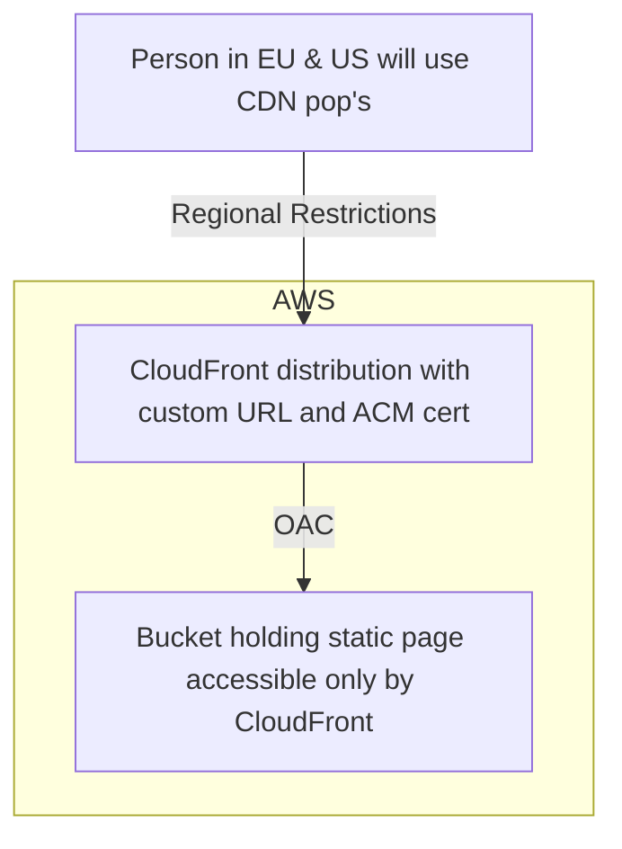

## Secrets List:

- AWS_ACCESS_KEY_ID (default)
- AWS_SECRET_ACCESS_KEY (default)
- BUCKET_ID (Bucket name 😂)
- DISTRIBUTION_ID (Generated by AWS Value)

## Main Action Body

```yaml
name: Deploy hermanowicz.co

on:
  push:
    branches:
      - main

jobs:
  deploy:
    runs-on: ubuntu-latest
    steps:
      - name: Checkout
        uses: actions/checkout@v3
      - name: Configure AWS Credentials
        uses: aws-actions/configure-aws-credentials@v1
        with:
          aws-access-key-id: ${{ secrets.AWS_ACCESS_KEY_ID }}
          aws-secret-access-key: ${{ secrets.AWS_SECRET_ACCESS_KEY }}
          aws-region: eu-west-1
      - name: Install modules
        run: npm ci
      - name: Build application
        run: npm run build
      - name: Deploy to S3
        run: aws s3 sync --delete ./dist/ s3://${{ secrets.BUCKET_ID }}
      - name: Create CloudFront invalidation
        run: | aws cloudfront create-invalidation
              --distribution-id ${{ secrets.DISTRIBUTION_ID }} --paths "/*"
```

## Mermaid diagram



## Links:

[Astro Docs](https://docs.astro.build/en/guides/deploy/aws/)
